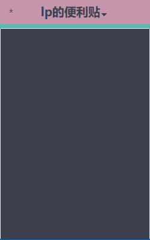

# Lps-Sticky-Notes

## Introduction
This is a windows software you can write anything you want. It is
developed by PyQt. This app can always be on the top of all windows.
It contains luxurious color themes.

## Functions
1. writing notes.
2. saving.
3. theme changing.

## Usage
1. click the file in "./Packing/main.exe"

## Update
2025.12.9

* Now can save the color and font size.
* Now can see the current theme.
* Fix the drag bug.

## Contact
